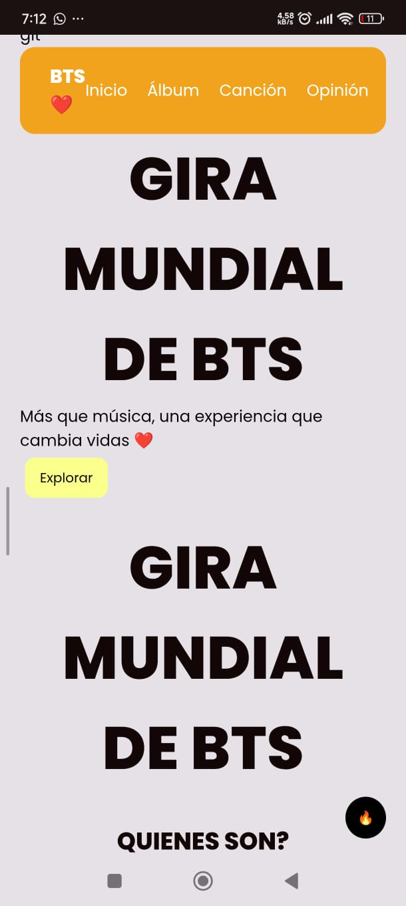

## 📸 Evidencias del proyecto

### Vista computadora

### Vista movil

## Aprendizajes

### 1. ¿Qué fue lo más fácil y lo más retador?
Elegí la temática de BTS porque es algo que me gusta mucho y me hace sentir cómoda al trabajar, lo cual hizo que el proceso fuera más disfrutable.

Lo más fácil fue estructurar el contenido con HTML y comenzar a diseñar visualmente la página, ya que tenía una idea clara de cómo quería que se viera.Lo más retador fue adaptarme a mis tiempos y organizar mis horarios para poder terminar el proyecto. También me costó lograr que el diseño fuera responsive, es decir, que se viera bien tanto en computadora como en dispositivos móviles.
Además, no me sentí completamente conforme con el resultado final, ya que sentí que podía mejorar varios detalles del diseño.

### 2. ¿Qué partes de HTML semántico y Flexbox usaste y por qué?
Utilicé etiquetas semánticas como `header`, `nav`, `section` y `footer` para estructurar mejor la página.  
Usé Flexbox para centrar elementos, acomodar el contenido y hacer que la página se adaptara a diferentes tamaños de pantalla.

### 3. ¿Cómo organizaste tus media queries?
Utilicé media queries con breakpoints en 768px y 480px para adaptar el diseño a tablet y móvil, ajustando tamaños de texto y distribución.
### 4. ¿Qué mejorarías en una siguiente versión?
Aunque no me sentí completamente satisfecha con el resultado final, disfruté mucho el proceso de experimentar y aprender.Me gustó trabajar con una temática que me hace feliz como BTS, incluyendo elementos visuales relacionados como colores, decoración y estilo.

En una siguiente versión me gustaría:
Agregar animaciones con CSS (hover más avanzados, transiciones)
Implementar JavaScript para hacer la página interactiva
Mejorar el diseño visual (tipografías, colores y jerarquía visual)
Agregar más contenido multimedia (imágenes, efectos, etc.)